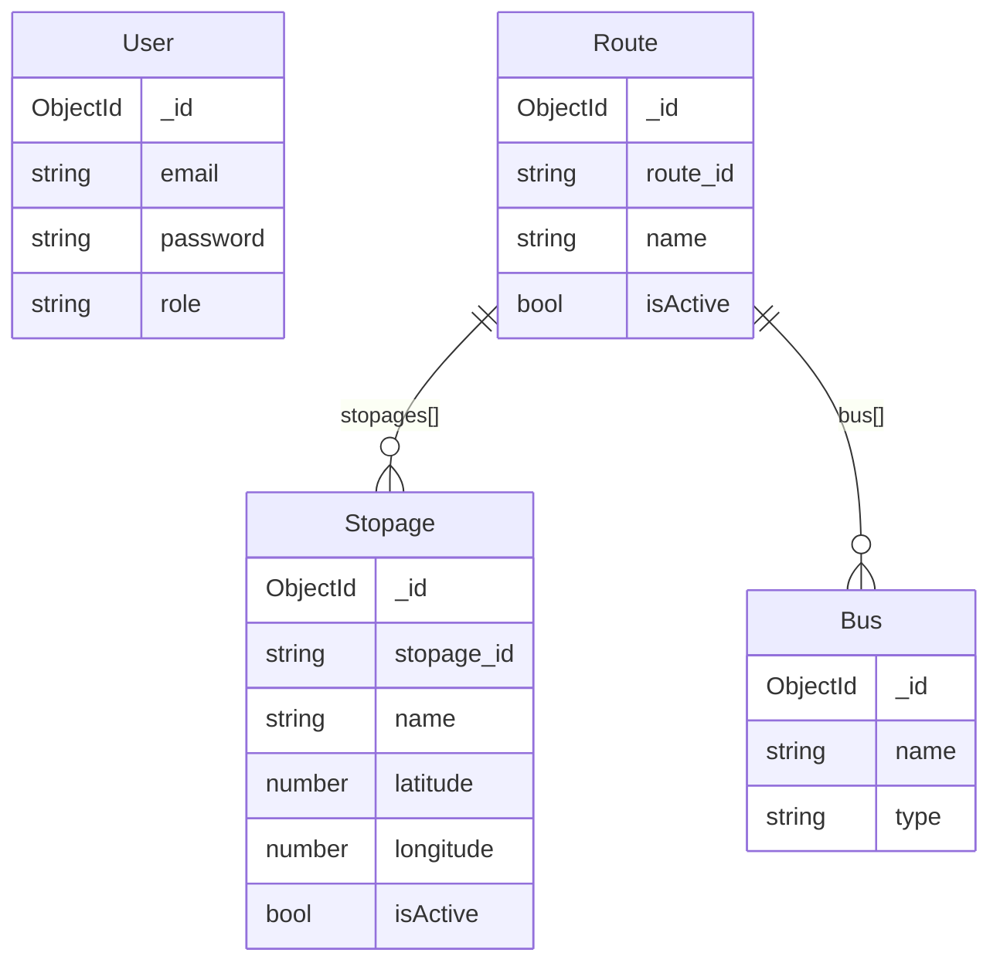

# ubts-server

## Database schema (MongoDB)

The server uses four Mongoose models. Route documents link buses and stopages; other models are standalone.

### Collections and fields
- **User**
  - `email` (unique, required), `password` (hashed), `name`
  - `role` (enum of `USER_ROLES`, required)
  - `clientITInfo` (device, browser, ipAddress, pcName, os, userAgent)
  - `clientInfo` (bio, department, rollNumber, licenseNumber)
  - `lastLogin`, `isActive`, `otpToken`, `otpExpires`, `needPasswordChange`, `resetPasswordExpires`, `resetPasswordToken`, `profileImage`
  - Automatic `createdAt`/`updatedAt`

- **Stopage**
  - `stopage_id` (unique, required), `name` (required), `latitude` (required), `longitude` (required), `isActive` (default `true`)
  - Automatic `createdAt`/`updatedAt`

- **Bus**
  - `name` (required), `type` (required; enum: `single-decker` | `double-decker`)
  - No `isActive` flag; availability is handled through Route associations.
  - Automatic `createdAt`/`updatedAt`

- **Route**
  - `route_id` (unique, required), `name` (required)
  - `stopages`: array of `ObjectId` references to **Stopage** (required)
  - `bus`: array of `ObjectId` references to **Bus** (required)
  - `isActive` (default `true`)
  - Automatic `createdAt`/`updatedAt`

### Relationship diagram

